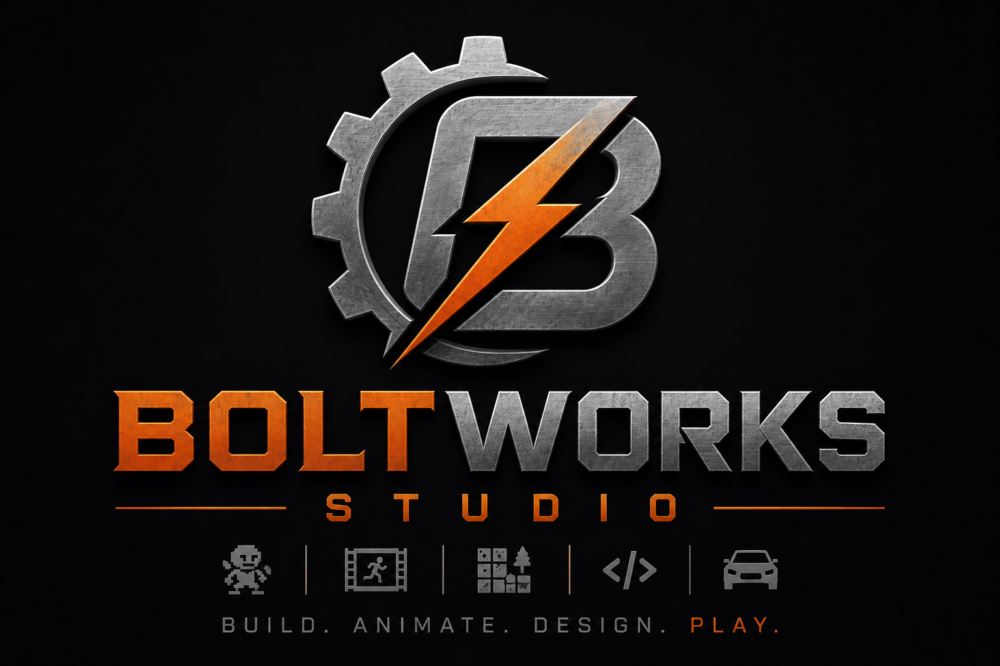

# BoltWorks 2D Studio



**BoltWorks 2D Studio** is a browser-based 2D creation toolkit for building layered side-scroller games, preparing sprite assets, assembling character animations, and exporting playable game builds.

It started alongside **Scrapyard Story**, but the editor itself is being rebuilt as a reusable tool for other 2D projects too.

## Current direction

The active rebuild is now the modular HTML/JavaScript editor in:

- `web/editor/index.html`
- `web/editor/js/core/`
- `web/editor/js/modules/`
- `web/editor/styles/`

The first goal is to recreate the best parts of the original single-file HTML prototype, but split into small maintainable modules instead of one giant JavaScript file.

The C# WinForms experiment has been removed. BoltWorks 2D Studio is now focused on the modular web editor, with the preserved legacy editor kept as a working reference while features are migrated.

## Run the modular web editor

Open:

```text
D:\Game\BoltWorks2DStudio\web\editor\index.html
```

or run:

```text
D:\Game\BoltWorks2DStudio\START_WEB_EDITOR.cmd
```

## Modules being rebuilt

- **Scene Builder:** scenes, starts, layers, triggers, placed objects, and player-start markers.
- **Asset Studio:** image import, shelves, background removal, sprite selection/cropping, and later texture painting.
- **Character Animator:** body layers, frame/timeline editing, transforms, and later bends/guides/export.
- **Part Builder:** future object/vehicle/component builder with removable parts, tool requirements, work time, break chance, and pay value.


## Full old working editor preserved

The complete previous HTML editor has been copied into this repo at:

```text
web/legacy-working-editor/index.html
```

Run it with:

```text
D:\Game\BoltWorks2DStudio\START_LEGACY_WORKING_EDITOR.cmd
```

This legacy copy contains the old full Asset Studio and Character Animator behavior while those systems are being ported into the new modular editor. The new editor also has an **Open Legacy Editor** button in the top bar for quick access.
## Original prototype features to port forward

The old prototype already explored these workflows:

- World editing with parallax layers, ground art, foreground art, props, buses, NPCs, gates, triggers, scene exits, and player starts.
- Asset Studio with large image sheets, background removal, selected-area extraction, asset shelves, paint/erase/tweak tools, and PNG export.
- Character Animator with layered body parts, standing/idle/walking/running/crawling/jumping/sitting animations, layer order, bends, guides, exports, and saved character setups.
- Car/object part building with tool requirements, removal times, break chance, and pay value.
- Browser playtesting with movement, object scripts, sound, bus behavior, triggers, and scene changes.

## Saving and asset storage

The modular rebuild will keep the same general idea:

- Working project data is saved locally in the browser while editing.
- **Save Project** creates a portable BoltWorks project file.
- Imported and extracted images can be embedded in project data, so a project can move between computers.
- Assets are only written as separate PNG files when an explicit download/export action is used.

## License and rights

Copyright (c) 2026 Daniel Rydin.

Source code is licensed under the [Apache License 2.0](LICENSE). BoltWorks branding and visual assets are not part of that license grant; see [TRADEMARKS.md](TRADEMARKS.md) and [ASSET-LICENSE.md](ASSET-LICENSE.md).

